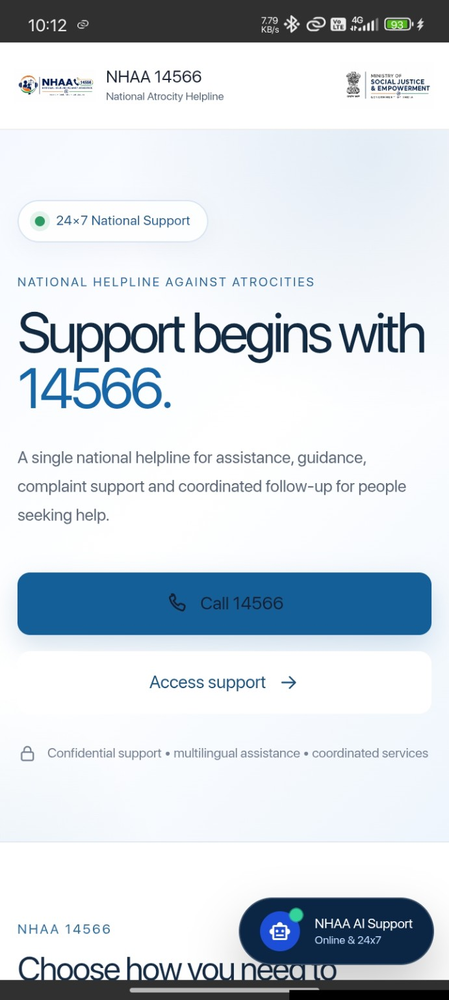
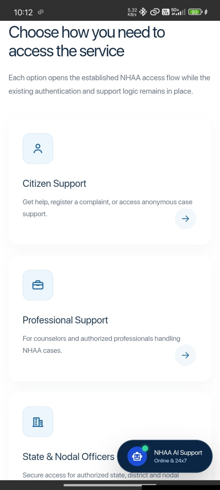
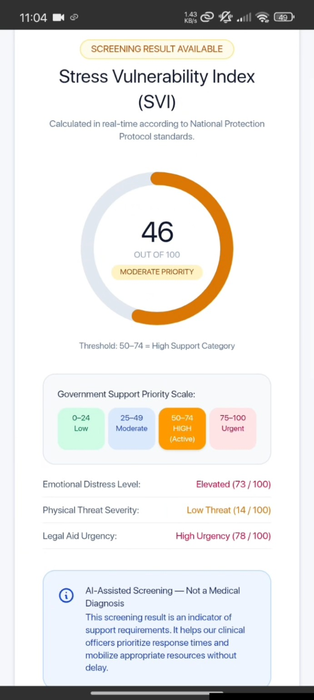
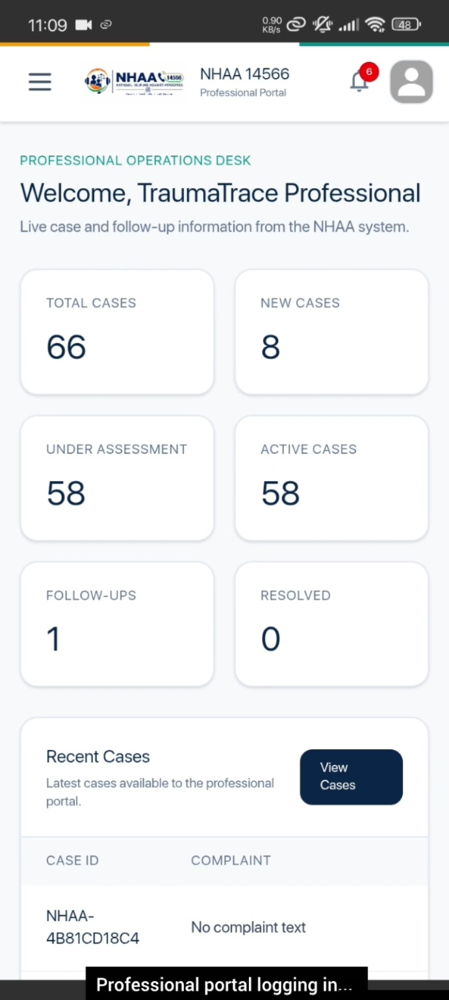
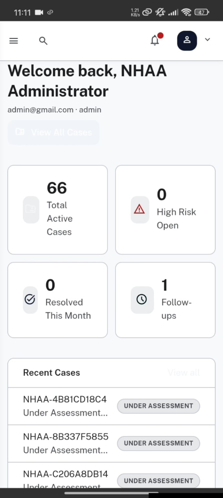

# 🛡️ TraumaTrace — Multilingual Trauma Support Platform

> A unified digital support platform designed to connect individuals seeking assistance with support services through web, mobile, professional, administrative, and IVRS interfaces.

**Smart India Hackathon 2026 — Prototype**

**Problem Statement ID:** 26093

**Team ID:** 119559

---

## 🎯 About the Project

**TraumaTrace** is an integrated support platform developed as a prototype for Smart India Hackathon 2026.

The platform brings multiple interfaces together into a unified ecosystem:

- 👤 Victim / User Portal
- 👨‍⚕️ Professional Portal
- 🛡️ Admin Portal
- 📱 Android Application
- ☎️ IVRS-based interaction
- 🌐 Multilingual support

The system is designed around a centralized backend API and database so that different portals can interact with the same application data.

---

## 💡 Problem

People seeking support may face difficulties accessing appropriate assistance through a single, accessible channel.

A support ecosystem therefore needs to provide:

- Multiple methods of interaction
- Accessible digital interfaces
- Secure authentication
- Centralized case information
- Communication between users and professionals
- Administrative monitoring
- Mobile accessibility
- Multilingual interaction

TraumaTrace was developed as a prototype to bring these capabilities together in one integrated system.

---

## ✨ Key Features

### 👤 Victim / User Portal

- User authentication
- Support/complaint submission
- Case-related interaction
- User-facing support interface
- Web and mobile access

### 👨‍⚕️ Professional Portal

- Professional-facing dashboard
- Case management
- Case details
- Follow-up management
- Reports
- Alerts
- Profile and account-related functionality

### 🛡️ Admin Portal

- Administrative dashboard
- Case management
- Professional management
- Follow-up management
- Reports
- Alerts
- Access permissions
- Security and settings interfaces

> The Admin Portal UI was designed as an established interface and integrated with the existing backend rather than rebuilding the portal from scratch.

### ☎️ IVRS

The project also includes an Interactive Voice Response System to provide an additional communication channel for users who may not rely entirely on web or mobile interfaces.

### 🌐 Multilingual Support

The platform is designed to support interaction across multiple Indian languages, making the system more accessible to a wider range of users.

### 📱 Android Application

The web application is integrated with Android using **Capacitor**, allowing the platform to be packaged and used as a mobile application.

---

## 🏗️ System Architecture

```text
                    ┌──────────────────────┐
                    │        User          │
                    └──────────┬───────────┘
                               │
                 ┌─────────────┴─────────────┐
                 │                           │
                 ▼                           ▼
        ┌─────────────────┐          ┌─────────────────┐
        │   Web Portal    │          │   Android App   │
        │      React      │          │    Capacitor    │
        └────────┬────────┘          └────────┬────────┘
                 │                            │
                 └────────────┬───────────────┘
                              │
                              ▼
                    ┌──────────────────┐
                    │   FastAPI API    │
                    │       v1         │
                    └────────┬─────────┘
                             │
              ┌──────────────┼──────────────┐
              │              │              │
              ▼              ▼              ▼
       Authentication    Complaints    Follow-ups
              │              │              │
              └──────────────┼──────────────┘
                             │
                             ▼
                    ┌──────────────────┐
                    │    PostgreSQL    │
                    │     Database     │
                    └──────────────────┘

                     Additional Channel
                             │
                             ▼
                           IVRS
```

---

## 👥 Portal Architecture

The project contains separate portal implementations while also providing a consolidated application.

```text
TraumaTrace
│
├── 👤 Victim Portal
│
├── 👨‍⚕️ Professional Portal
│
├── 🛡️ Admin Portal
│
├── 📱 Unified Single App
│
├── ☎️ IVRS
│
└── ⚙️ FastAPI Backend
```

---

## 🛠️ Technology Stack

### Frontend

| Technology | Purpose |
|---|---|
| React | User interface development |
| Vite | Frontend development and build tooling |
| TypeScript | Type-safe development |
| Tailwind CSS | Styling |
| React Router | Application routing |
| TanStack Router | Professional portal routing |
| TanStack React Query | Data fetching/state management |
| React Hook Form | Form handling |
| Zod | Validation |
| Radix UI | UI components |
| Recharts | Data visualization |
| Lucide React | Icons |

### Backend

| Technology | Purpose |
|---|---|
| Python | Backend programming |
| FastAPI | REST API framework |
| SQLAlchemy | Database ORM |
| PostgreSQL | Relational database |
| Alembic | Database migrations |
| JWT | Authentication |

### Mobile

| Technology | Purpose |
|---|---|
| Capacitor | Web-to-mobile integration |
| Android | Mobile application platform |

---

## 🔐 Authentication & Security

The backend provides authentication and protected API functionality.

The application uses:

- JWT-based authentication
- Password hashing
- Authenticated API dependencies
- Role-based user information
- Environment-based configuration
- Protected backend endpoints

Sensitive configuration is stored through environment variables rather than committed credentials.

---

## ⚙️ Backend API

The backend exposes a versioned API:

```text
/api/v1
```

Major backend areas include:

```text
/api/v1/auth
/api/v1/complaints
/api/v1/followups
/api/v1/users
/api/v1/svi
```

FastAPI also provides interactive API documentation during local development.

---

## 📁 Project Structure

```text
TraumaTrace-NHAA/
│
├── backend/
│   ├── app/
│   │   ├── api/
│   │   ├── core/
│   │   ├── db/
│   │   └── models/
│   │
│   ├── alembic/
│   ├── requirements.txt
│   ├── alembic.ini
│   └── README.md
│
├── frontend/
│   ├── Admin portal react/
│   ├── Professional portal react1/
│   ├── Victim portal react/
│   └── nhaa-single-app/
│       ├── android/
│       ├── public/
│       ├── src/
│       ├── package.json
│       └── vite.config.js
│
├── LANDING1/
│
├── screenshots/
│   ├── mobile-landing.jpg
│   ├── mobile-access-options.jpg
│   ├── mobile-svi-screening.jpg
│   ├── mobile-professional-portal.jpg
│   └── mobile-admin-portal.jpg
│
├── .gitignore
└── package-lock.json
```

---

## 🚀 Running the Backend

### 1. Navigate to the backend

```bash
cd backend
```

### 2. Create a virtual environment

```bash
python -m venv .venv
```

### 3. Activate the environment

**Windows PowerShell:**

```powershell
.\.venv\Scripts\Activate.ps1
```

### 4. Install dependencies

```bash
pip install -r requirements.txt
```

### 5. Configure environment variables

Create a local `.env` file based on:

```text
.env.example
```

Do not commit your `.env` file to GitHub.

### 6. Run the FastAPI server

```bash
uvicorn app.main:app --reload --host 127.0.0.1 --port 8000
```

The API will be available at:

```text
http://127.0.0.1:8000
```

FastAPI documentation:

```text
http://127.0.0.1:8000/docs
```

---

## 🚀 Running the Frontend

Navigate to the unified application:

```bash
cd frontend/nhaa-single-app
```

Install dependencies:

```bash
npm install
```

Start the development server:

```bash
npm run dev
```

Build the application:

```bash
npm run build
```

---

## 📱 Android Build

The project uses Capacitor for Android integration.

After building the web application:

```bash
npm run build
```

Synchronize the web application with Android:

```bash
npx cap sync android
```

The Android project can then be opened using Android Studio.

---

## 📸 Application Screenshots

### 📱 NHAA 14566 Mobile Application

The TraumaTrace/NHAA platform is packaged as an Android application using Capacitor, providing access to the support ecosystem from mobile devices.

<p align="center">
  
</p>

### 👤 Citizen Support Access

Users can access different support channels including citizen services, professional services and administrative interfaces from the unified application.

<p align="center">
  
</p>

### 🧠 SVI Screening

The application includes an SVI screening workflow that processes user responses and presents screening results through the mobile interface.

<p align="center">
  
</p>

### 👨‍💼 Professional Portal

Professionals can access a dedicated operational dashboard for case-related workflows, follow-ups, alerts and support activities.

<p align="center">
  
</p>

### 🛡️ Admin Portal

The administrative interface provides a centralized dashboard for monitoring and managing platform operations.

<p align="center">
  
</p>

> These screenshots demonstrate the Smart India Hackathon prototype running as an Android application through Capacitor.

---

## 🔄 Application Flow

```text
User

 │
 ├── Web
 │
 ├── Android
 │
 └── IVRS
      │
      ▼
Authentication / Interaction
      │
      ▼
FastAPI Backend
      │
      ├── Users
      ├── Complaints
      ├── Follow-ups
      └── Other API services
      │
      ▼
PostgreSQL Database
      │
      ▼
Professional / Admin Interfaces
```

---

## 🏆 Smart India Hackathon 2026

TraumaTrace was developed as a prototype for:

**Smart India Hackathon 2026**

| Detail | Information |
|---|---|
| Problem Statement ID | **26093** |
| Team ID | **119559** |
| Project | **TraumaTrace / NHAA Support Platform** |
| Project Type | Prototype |

---

## 🎥 Demo

Project demonstration videos can be added here:

- 🌐 Website Demo — *Add YouTube link*
- 📱 Android App Demo — *Add YouTube link*
- ☎️ IVRS Demo — *Add YouTube link*

---

## 🔒 Disclaimer

This project is developed as a **Smart India Hackathon prototype** for demonstration and educational purposes.

It should not be considered a production-ready replacement for professional, medical, legal, emergency, or government services.

---

## 👩‍💻 Developer

### Bhavadharani S

**B.Tech Information Technology | 2024–2028**

Arunai Engineering College, Tiruvannamalai

GitHub:

**[@Bhavadharani-git](https://github.com/Bhavadharani-git)**

---

## 📌 Project Status

**Prototype / Academic Project**

The project is actively being improved and can be extended with additional functionality, integrations, testing, deployment, and production-level security.

---

⭐ If you find this project interesting, feel free to explore the repository and learn more about the implementation.